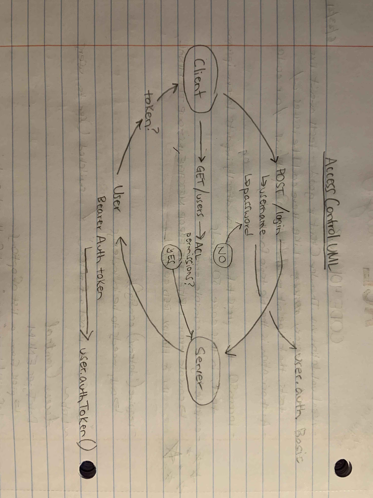

# auth-api

> In this final phase, the new requirement is to extend the restrictive capabilities of our routes to our API, implementing a fully functional, authenticated and authorized API Server using the latest coding techniques

---

## User Permissions

- user: 'read',
- writer: 'read', 'create'
- editor: 'read', 'create', 'update'
- admin: 'read', 'create', 'update', 'delete'

## Routes

### /signup

* req, res, next
* JSON response: {"username":"value", "password":"value", "role":"value"}

### /signin

* req, res, next
* JSON response: none
* Authentication: basic (username and password)

### /users

* requires bearer authentication, admin as user "role."

### /secrets

* requires writer, editor, or admin as user "role."

### /api/v2/food

* CRUD depends on user permissions

### /api/v2/clothes

* CRUD depends on user permissions

--- 

## URLs

[Deployed page here](https://timegorov-auth-api.herokuapp.com)